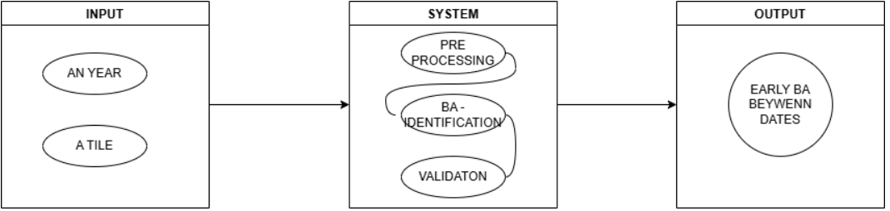

# About 

This Study is designed to assist researchers in accessing information from multiple APIs related to burned areas using a MIMO (Multiple Input Multiple Output) system, as outlined below. It demonstrates how to retrieve the correct parameters from the necessary matrices and vectors. The goal is to input a tile and a date, and receive a JSON (JavaScript Object Notation) response containing data for both the before and after dates, along with relevant STAC (SpatioTemporal Asset Catalog) items and information on the presence or absence of burned areas in the image.

# Paths
- the fuction is in the patk called [modules](module) 
- at the path [Jupyter](jupyter) are represented some exemples of access to the files;

    -  the [bbox_from_firespot](jupyter/bbox_from_firespot.ipynb) is a tutorial on how the access of files via WFS can be done to access the firespots from `[INPE-Programa queimadas](https://terrabrasilis.dpi.inpe.br/queimadas/portal/);

    - The [burned_areas_from_stac](jupyter/burned_areas_from_stac.ipynb) present the complete logic behind the [early-ba-detection](module/early-ba-detection.py);

- The [older-version](older-versions) present all the versions and atualizations;

-  in the main at the file `requirements.txt` all of the versions of the needed packages are passed;

- the main file where all the fuctions are it is the [early-ba-detection](module/early-ba-detection.py);